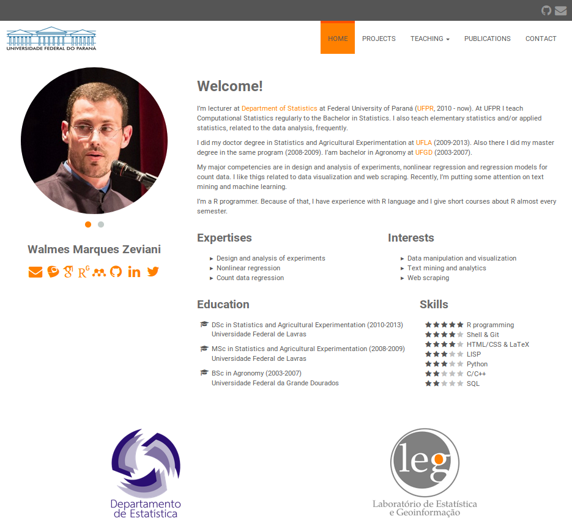

# Walmes Zeviani's homepage



## Details

[My homepage](http://www.leg.ufpr.br/~walmes/home/) is inspired on
[Paula Moraga's homepage](https://paula-moraga.github.io/).  It is done
with [Hugo](https://gohugo.io/) and based on
[Universal](https://themes.gohugo.io/hugo-universal-theme/) theme.

I did some modifications in the original Universal theme to add elements
to my home page. You can see it on [my
fork](https://github.com/walmes/hugo-universal-theme) of the Universal
theme project.

To use this template, first clone the project with submodules
(`--recursive`).

```
# Using SSH protocol.
git clone --recursive git@github.com:walmes/walmes.github.io.git

# Using HTTP protocol.
git clone --recursive https://github.com/walmes/walmes.github.io.git
```

Start `hugo server` at the root of the directory. If you don't have hugo
installed, please visit [Install Hugo](https://gohugo.io/getting-started/installing/).

```
hugo server
```

Now, do all modifications that you want and publish your homepage.

Please, report bugs and any improvement.
